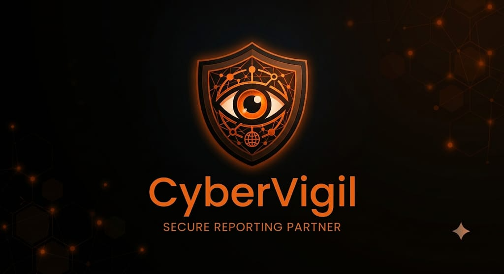

# CyberVigil: Trauma-Informed Child Cyber Defense Ecosystem

<p align="center">
  
</p>

<p align="center">
  <a href="https://reactjs.org/"></a>
  <a href="https://vitejs.dev/"></a>
  <a href="https://www.typescriptlang.org/"></a>
  <a href="https://tailwindcss.com/"></a>
  <a href="https://ai.google.dev/"></a>
  <a href="LICENSE"></a>
  <a href="https://vercel.com/new/clone?repository-url=https%3A%2F%2Fgithub.com%2FDakshesh-07%2FCyberVigil&env=VITE_GEMINI_API_KEY,VITE_GEMINI_MODEL&envDescription=Enter%20your%20Google%20Gemini%20API%20Key%20and%20Model"></a>
</p>

---

## Overview

**CyberVigil** is a trauma-informed, privacy-first digital defense web application engineered to protect children, adolescents, students, and young adults against online harms, including cyberbullying, sexual extortion (sextortion), grooming, unauthorized impersonation, and phishing scams.

Built for both immediate victim assistance and long-term resilience, CyberVigil combines:
- **Client-side zero-knowledge evidence preservation** (EXIF stripping and SHA-256 hashing)
- **Unblocked real-time AI safety triage** powered by Google Gemini
- **Role-based statutory portals** for Students, Youth Defenders, Parents, and Police Inspectors
- **Instant Two-Factor (2FA) Email OTP Verification** with test-bypass credentials
- **Statutory Identity Proof Verification** to prevent impersonation in restricted roles
- **Live synchronized incident reporting** with a POCSO Law Enforcement Triage Desk
- **Multi-Persona Quick Escape Camouflage Mode** (<kbd>ESC</kbd>) for emergency privacy

---

## Key Features

### 1. Safety Gateways

- **Guardian AI Assistant (`/assistant`)**:
  - Powered by Google Gemini (`gemini-3.6-flash`) with calibrated trauma-informed safety prompts.
  - Context-aware assistance for cyberbullying, online grooming, blackmail, and phishing detection.
  - Automated safety handoff banners connecting immediately to Childline 1098 and Cyber Crime 1930.

- **Forensic Incident Reporting (`/report`)**:
  - Client-side EXIF/GPS metadata stripping from attached photos before storage.
  - Real-time SHA-256 cryptographic evidence checksum calculation (court-admissible under Section 65B of the Indian Evidence Act).
  - 100% anonymous reporting option with instant 6-character Case Reference PIN tracking.
  - Automatically synchronizes with the Officer Portal in real-time.

- **POCSO Child Welfare & Police Officer Portal (`/portal`)**:
  - Restricted law-enforcement triage desk for sworn police inspectors and nodal officers.
  - Live incident pipeline: view reports, update status (`Under Review`, `Active Investigation`, `FIR Registered`, `Resolved`), assign officers, and generate takedown advisories.
  - Instant forensic dossier and evidence checksum inspection.

- **Brave Community Stories (`/stories`)**:
  - Peer-driven survivor support forum for youth to read and publish brave recovery stories.
  - Anonymous or alias authoring with verified role badges (`Student`, `Youth Defender`, `Parent`, `Inspector`).
  - Recent-first dynamic sorting and interactive community support upvoting.

- **Digital Resilience Academy (`/learn`)**:
  - Interactive self-defense learning modules with scenario simulations, progress tracking, and knowledge quizzes covering password security, catfishing, digital boundaries, and scam evasion.

- **SafeConnect Circles (`/safeconnect`)**:
  - Verified directory of accredited adolescent psychologists, POCSO legal aid desks, and institutional youth counselors.

---

### 2. Multi-Persona Quick Escape (Camouflage Mode)

Pressing <kbd>ESC</kbd> or clicking the stealth toggle instantly conceals CyberVigil behind realistic, fully interactive educational disguises to protect users from over-the-shoulder monitoring:

- **Class 4 Primary School**: NCERT *Looking Around* EVS and *Math-Magic* interactive kid quizzes.
- **Class 10 High School**: CBSE digital science textbook covering respiration biology and Ohm's law.
- **College / University LMS**: B.Tech CS301 syllabus featuring Dijkstra's algorithm and an interactive code terminal sandbox that compiles test cases in real-time.
- **YouTube Study Stream**: Functional video player layout with play/pause, dynamic likes counter, comments feed, and recommended video switching.
- **Discreet Resume Control**: The resume toggle is hidden inside the academic student profile dropdown to maintain absolute operational security.

---

### 3. Role-Based Access Control (RBAC) Clearance Levels

CyberVigil features granular clearance tiers and permissions designed to enforce strict role separation and protect sensitive child safety workflows:

| Role / Persona | Clearance Tier | Access Scope & Permissions |
| :--- | :--- | :--- |
| **Student** | Shield Level 1 (Institutional Verified) | Digital resilience modules, community stories access, confidential incident intake |
| **Youth Defender** | Shield Level 1 (Peer Defender Verified) | Peer community moderation, survivor story publishing, digital safety advocacy |
| **Parent / Guardian** | Family Safe Mode (Verified) | Ward incident tracking, family protection advisories, direct counselor liaison |
| **Police Inspector** | Level 3 Clearance (POCSO Statutory) | Statutory incident triage, platform takedown dispatch, forensic dossier exports |
| **Anonymous Minor** | Ephemeral Session | Zero-PII evidence preservation, one-time Case Reference PIN tracking |

> **Two-Factor Authentication (2FA)**: Account registration and login workflows incorporate an automated 6-digit Email OTP verification protocol to safeguard accounts against unauthorized access.

---

### 4. Statutory Identity Proof Verification

To ensure random individuals cannot register or log in to restricted positions, both [`Register.tsx`](src/pages/Register.tsx) and [`Login.tsx`](src/pages/Login.tsx) enforce mandatory identity proof verification:

- **Police Inspector**: Requires Police Service ID Card / POCSO Statutory Nodal Desk Card number and department verification.
- **Parent / Guardian**: Requires Government Photo ID (Aadhaar, Voter ID, Passport, Driving License) and linked Ward PIN.
- **Student Defender**: Requires Student Defender Accreditation ID or Institutional Peer Defense Card.
- **Student**: Requires School / College Photo ID or Institutional Enrollment number.

---

## Technology Stack

- **Frontend**: React 18 with TypeScript
- **Build Tool**: Vite 6
- **Styling**: Tailwind CSS 3.4 with warm slate & amber design system tokens
- **Icons**: Lucide React
- **AI Intelligence**: Google Gemini API (`gemini-3.6-flash` via `@google/genai`)
- **Backend / Database**: Supabase JS client integration (`@supabase/supabase-js`) & local synchronized persistence engine
- **Deployment**: Vercel ready with client-side SPA routing (`vercel.json`)

---

## Getting Started

### Prerequisites
- **Node.js**: v18.0.0 or higher
- **npm**: v9.0.0 or higher

### Installation

1. **Clone the repository:**
   ```bash
   git clone https://github.com/Dakshesh-07/CyberVigil.git
   cd CyberVigil
   ```

2. **Install dependencies:**
   ```bash
   npm install
   ```

3. **Configure Environment Variables:**
   Copy the example environment configuration template:
   ```bash
   cp .env.example .env
   ```
   Edit `.env` and add your Google Gemini API key:
   ```env
   VITE_GEMINI_API_KEY=your_google_gemini_api_key_here
   VITE_GEMINI_MODEL=gemini-3.6-flash
   ```

4. **Start Local Development Server:**
   ```bash
   npm run dev
   ```
   Open your browser at `http://localhost:5173`.

5. **Typecheck & Build for Production:**
   ```bash
   # Run TypeScript compilation check
   npx tsc --noEmit

   # Create production build in dist/
   npm run build

   # Preview the production bundle locally
   npm run preview
   ```

---

## Project Structure

```
CyberVigil/
├── public/
│   ├── cybervigil-banner.png     # Brand banner asset
│   ├── cybervigil-shield.png     # Brand shield asset
│   ├── favicon.ico               # Browser favicon
│   ├── shield.svg                # Vector shield logo
│   └── stories/                  # Community story cover images
├── src/
│   ├── components/
│   │   ├── auth/
│   │   │   ├── EmailOTPModal.tsx     # 2FA Email OTP modal with resend countdown
│   │   │   └── ProtectedRoute.tsx    # Role-based route authorization guards
│   │   └── layout/
│   │       ├── CamouflageOverlay.tsx # 4-Persona Quick Escape emergency overlay
│   │       ├── EmergencyBanner.tsx   # Top banner with Childline 1098 hotline
│   │       ├── Footer.tsx            # Footer navigation and legal disclosures
│   │       └── Navbar.tsx            # Dynamic navbar with role and page context
│   ├── context/
│   │   └── AuthContext.tsx       # RBAC auth state, credentials & identity proof
│   ├── lib/
│   │   ├── gemini.ts             # Google Gemini AI client integration
│   │   └── supabase.ts           # Supabase client connector
│   ├── pages/
│   │   ├── AIAssistant.tsx       # Trauma-informed Guardian AI chat interface
│   │   ├── BraveStories.tsx      # Community recovery stories & authoring
│   │   ├── Home.tsx              # Interactive safety gateways & simulator
│   │   ├── LandingPage.tsx       # Public showcase & feature introduction
│   │   ├── Learn.tsx             # Digital resilience academy modules
│   │   ├── Login.tsx             # Multi-tab login with identity credentials
│   │   ├── OrgPortal.tsx         # POCSO officer investigation portal
│   │   ├── Register.tsx          # Multi-category registration with identity proof
│   │   ├── ReportIncident.tsx    # Forensic incident intake & EXIF scrubbing
│   │   ├── SafeConnect.tsx       # Accredited counselor directory
│   │   └── SecurityHub.tsx       # SHA-256 evidence hasher & session purge
│   ├── types/
│   │   └── index.ts              # Global TypeScript interfaces & data models
│   ├── utils/
│   │   └── localStore.ts         # Resilient browser session storage
│   ├── App.tsx                   # Top-level routing & layout shell
│   ├── index.css                 # Tailwind design tokens & dark mode classes
│   └── main.tsx                  # Application entry point
├── .env.example                  # Environment variable template
├── .gitignore                    # Git ignore file for secrets and dependencies
├── LICENSE                       # MIT License
├── package.json                  # Dependencies and build scripts
├── tailwind.config.js            # Custom color schemes & font config
├── tsconfig.json                 # TypeScript compiler configuration
├── vercel.json                   # Vercel SPA rewrite rules
└── vite.config.ts                # Vite dev server and proxy configuration
```

---

## Deployment on Vercel

CyberVigil includes a [`vercel.json`](vercel.json) file that automatically configures Single Page Application (SPA) routing.

### 1-Click Deploy
Click the button below to deploy your own instance to Vercel:

[](https://vercel.com/new/clone?repository-url=https%3A%2F%2Fgithub.com%2FDakshesh-07%2FCyberVigil&env=VITE_GEMINI_API_KEY,VITE_GEMINI_MODEL&envDescription=Enter%20your%20Google%20Gemini%20API%20Key%20and%20Model)

### Manual Deployment via Vercel Dashboard
1. Push your repository to GitHub.
2. Import the repository into [Vercel](https://vercel.com/new).
3. Under **Environment Variables**, add:
   - `VITE_GEMINI_API_KEY`: Your Google Gemini API Key
   - `VITE_GEMINI_MODEL`: `gemini-3.6-flash`
4. Click **Deploy**.

---

## Statutory Notice & Emergency Helplines

CyberVigil is an educational and digital first-aid resource. If you or someone you know is in immediate physical danger or encountering Child Sexual Abuse Material (CSAM), immediately contact official statutory authorities:

- **Childline India**: `1098` (Toll-Free, 24/7)
- **National Cyber Crime Reporting Portal**: `1930` or [cybercrime.gov.in](https://cybercrime.gov.in)
- **National Commission for Protection of Child Rights (NCPCR)**: [ncpcr.gov.in](https://ncpcr.gov.in)

---

## License

This project is licensed under the [MIT License](LICENSE) - see the LICENSE file for details.
